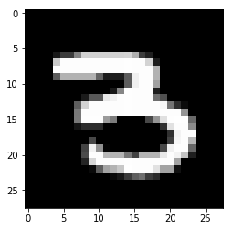

```python
from keras.datasets import mnist
from keras.models import Sequential
from keras.layers import Input, Dense, Dropout
from keras.utils import to_categorical
import matplotlib as mat

(X_train, Y_train),(X_test, Y_test) = mnist.load_data()
x_train = X_train.reshape(60000, 784)
x_test = X_test.reshape(10000, 784)
cn = mat.colors.Normalize(vmin=0, vmax= 255)
x_train = cn(x_train)
x_test = cn(x_test)
y_train = to_categorical(Y_train, 10)
y_test = to_categorical(Y_test, 10)

model = Sequential()
model.add(Dense(512, activation='relu', input_shape= (784,)))
model.add(Dropout(0.25))
model.add(Dense(512, activation='relu'))
model.add(Dropout(0.25))
model.add(Dense(10, activation='softmax'))
model.compile(optimizer= 'sgd',
              loss='categorical_crossentropy',
              metrics=['accuracy'])
model.fit(x_train, y_train, epochs=20, batch_size=128,
              validation_data=(x_test, y_test))
score = model.evaluate(x_test, y_test, batch_size=128)
print(score)
```

    Using TensorFlow backend.


    Downloading data from https://s3.amazonaws.com/img-datasets/mnist.npz
    11493376/11490434 [==============================] - 20s 2us/step
    Train on 60000 samples, validate on 10000 samples
    Epoch 1/20
    60000/60000 [==============================] - 14s 233us/step - loss: 1.2542 - acc: 0.6618 - val_loss: 0.5432 - val_acc: 0.8695
    Epoch 2/20
    60000/60000 [==============================] - 12s 200us/step - loss: 0.5553 - acc: 0.8408 - val_loss: 0.3790 - val_acc: 0.8969
    Epoch 3/20
    60000/60000 [==============================] - 13s 218us/step - loss: 0.4418 - acc: 0.8698 - val_loss: 0.3236 - val_acc: 0.9087
    Epoch 4/20
    60000/60000 [==============================] - 13s 209us/step - loss: 0.3896 - acc: 0.8864 - val_loss: 0.2931 - val_acc: 0.9144
    Epoch 5/20
    60000/60000 [==============================] - 12s 203us/step - loss: 0.3539 - acc: 0.8987 - val_loss: 0.2722 - val_acc: 0.9217
    Epoch 6/20
    60000/60000 [==============================] - 13s 211us/step - loss: 0.3312 - acc: 0.9051 - val_loss: 0.2556 - val_acc: 0.9245
    Epoch 7/20
    60000/60000 [==============================] - 11s 183us/step - loss: 0.3087 - acc: 0.9107 - val_loss: 0.2413 - val_acc: 0.9284
    Epoch 8/20
    60000/60000 [==============================] - 11s 185us/step - loss: 0.2920 - acc: 0.9151 - val_loss: 0.2284 - val_acc: 0.9338
    Epoch 9/20
    60000/60000 [==============================] - 11s 182us/step - loss: 0.2763 - acc: 0.9212 - val_loss: 0.2170 - val_acc: 0.9365
    Epoch 10/20
    60000/60000 [==============================] - 11s 181us/step - loss: 0.2623 - acc: 0.9238 - val_loss: 0.2076 - val_acc: 0.9396
    Epoch 11/20
    60000/60000 [==============================] - 11s 180us/step - loss: 0.2512 - acc: 0.9275 - val_loss: 0.1991 - val_acc: 0.9409
    Epoch 12/20
    60000/60000 [==============================] - 11s 182us/step - loss: 0.2398 - acc: 0.9299 - val_loss: 0.1906 - val_acc: 0.9443
    Epoch 13/20
    60000/60000 [==============================] - 11s 180us/step - loss: 0.2303 - acc: 0.9324 - val_loss: 0.1824 - val_acc: 0.9466
    Epoch 14/20
    60000/60000 [==============================] - 11s 176us/step - loss: 0.2218 - acc: 0.9356 - val_loss: 0.1763 - val_acc: 0.9480
    Epoch 15/20
    60000/60000 [==============================] - 11s 179us/step - loss: 0.2123 - acc: 0.9393 - val_loss: 0.1697 - val_acc: 0.9509
    Epoch 16/20
    60000/60000 [==============================] - 11s 179us/step - loss: 0.2055 - acc: 0.9411 - val_loss: 0.1641 - val_acc: 0.9524
    Epoch 17/20
    60000/60000 [==============================] - 11s 179us/step - loss: 0.1986 - acc: 0.9416 - val_loss: 0.1591 - val_acc: 0.9536
    Epoch 18/20
    60000/60000 [==============================] - 11s 177us/step - loss: 0.1921 - acc: 0.9440 - val_loss: 0.1544 - val_acc: 0.9558
    Epoch 19/20
    60000/60000 [==============================] - 11s 179us/step - loss: 0.1861 - acc: 0.9463 - val_loss: 0.1497 - val_acc: 0.9562
    Epoch 20/20
    60000/60000 [==============================] - 11s 178us/step - loss: 0.1824 - acc: 0.9471 - val_loss: 0.1455 - val_acc: 0.9581
    10000/10000 [==============================] - 1s 66us/step
    [0.14549248195290565, 0.95809999999999995]


```python
score = model.evaluate(x_test, y_test, verbose=0)
print('Test loss:', score[0])
print('Test accuracy:', score[1])
"""Summarize and visualize the model"""
# Summary of neural network
model.summary()
```

    Test loss: 0.15025135114
    Test accuracy: 0.9552
    _________________________________________________________________
    Layer (type)                 Output Shape              Param #   
    =================================================================
    dense_18 (Dense)             (None, 512)               401920    
    _________________________________________________________________
    dense_19 (Dense)             (None, 512)               262656    
    _________________________________________________________________
    dropout_1 (Dropout)          (None, 512)               0         
    _________________________________________________________________
    dense_20 (Dense)             (None, 10)                5130      
    =================================================================
    Total params: 669,706
    Trainable params: 669,706
    Non-trainable params: 0
    _________________________________________________________________


```python
import numpy as np
import matplotlib.pyplot as plt

input = np.array(x_test[51]).reshape(1,784)
prediction = model.predict_classes(input, verbose=1)
print(prediction)
plt.imshow(X_test[51], cmap='gray', interpolation='none'
)
plt.show()

```

    1/1 [==============================] - 0s 2ms/step
    [3]



